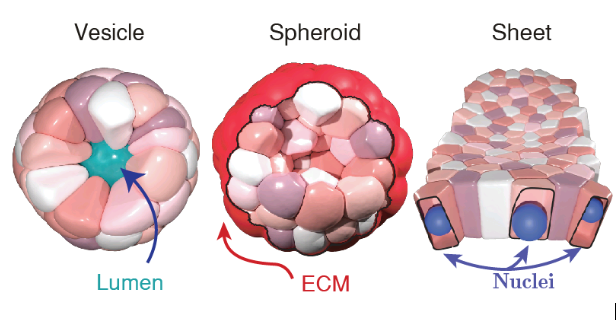

# SimuCell3D


SimuCell3D is a C++ cell-based simulation framework designed to simulate tissues in 3 dimensions with high geometrical resolution.


<p align="center">
    
</p>


<br>

## Manual installation on linux

Windows user can manually install SimuCell3D on their machine via a Windows Linux Subsystem ([WSL](https://learn.microsoft.com/en-us/windows/wsl/install)).

### Requirements
- GCC compiler at version 9 or higher
- CMake at version 3.0 or higher

<br>
<strong>1.</strong> Clone this git repository

```
git clone https://github.com/SteveRunser/SimuCell3D_v2.git
```

<br>
<strong>2.</strong> Create a build folder in the repository

```
mkdir path/to/SimuCell3D/build && cd "$_"
```

<br>
<strong>3.</strong> Compile the code

```
cmake -DCMAKE_BUILD_TYPE=Release .. && make -j4
```
<br>

## Automatic installation on any operating system with Docker

### Requirements
- Docker

<br>
<strong>1.</strong> Clone this git repository

```
git clone https://github.com/SteveRunser/SimuCell3D_v2.git
cd path/to/SimuCell3D/
```

<br>
<strong>2.</strong> Create the docker image

```
docker build -t simucell3d_docker_img .
```

<br>
<strong>3.</strong> Create a folder to store the simulation results

```
mkdir -p simulation_results
```

<br>

## How to launch a simulation?

SimuCell3D needs 2 input files to initialize the simulations:  
&nbsp;&nbsp;&nbsp;&nbsp;&nbsp;&nbsp;<strong>1.</strong> A parameter file at the XML format (ex: path/to/SimuCell3D/parameters.xml)

&nbsp;&nbsp;&nbsp;&nbsp;&nbsp;&nbsp;<strong>2.</strong> An initial mesh geometry in the VTK format  (ex: path/to/SimuCell3D/data/input_meshes/cube.vtk)
<br>
More information on the structure of these files can be found at [here](./doc/parameter_file_doc.md) and [here](./doc/parameter_file_doc.md)

<br>

### If SimuCell3D has been installed manually:

```
cd path/to/SimuCell3D/build
./simucell3d path/to/parameter/file #ex: ./simucell3d ../parameters_default_dynamic.xml
```
The output files will be saved based on the output folder path specified in the parameter file.

<br>

### If SimuCell3D has been installed with Docker:

```
docker run -it -v "$(pwd)/simulation_results":/app/simulation_results  simucell3d_docker_img:latest ../parameters_default_dynamic.xml
```

In this second case, note that the parameter file path is relative to the build folder and only files in the repository can be accessed from the container. To add a file to the container, it must be added to the repository and then the container must be rebuilt. The simulation results will be saved in the simulation_results folder.

<br>

## What output files does SimuCell3D create?

The output files of a simulation are structured in the following way: 
```
.
|-- 
|   |-- output_folder_path
|		|-- simulation_statistics.csv
|		|-- cell_data
|			|-- result_0.vtk
|			|-- result_1.vtk
|			|-- ...
|		|-- face_data
|			|-- result_0.vtk
|			|-- result_1.vtk
|			|-- ...
|   |-- ...
|...
```

The output folder path can be specified in the `parameter.xml` file. 

The `simulation _statistics.csv` file contains simulation statistics such as the cell areas and volumes over time. More information on this file can be found [here](./doc/output_statistics.md). 

Finally, the `cell_data` and `face_data` folders contain meshes of the tissue at different iterations. The `cell_data` meshes can be used to visualize the cell attributes (ex: volume, pressure etc). Whereas, the `face_data` meshes are used to visualize the atributes of the faces of the cells (triangle area, adhesion energy etc). 

Both type of meshes can be visualized with the rendering software [Paraview](https://www.paraview.org/download/).

<br>

## Additional documentation
Several tutorials have been added to this repository to explain how to launch simulations or edit the framework: 
- [How to configure the parameters of a simulation?](./doc/parameter_file_doc.md)
- [How are input meshes formatted?](./doc/input_mesh_format.md)
- [How to generate initial geometries?](./doc/mesh_generation.md)
- [What are the files saved by SimuCell3D?](./doc/output_statistics.md)  
- [How to run a parameter screen on a cluster?](./doc/parameter_screen.md)
- [How to run SimuCell3D from python?](./doc/python_support.md)

 
