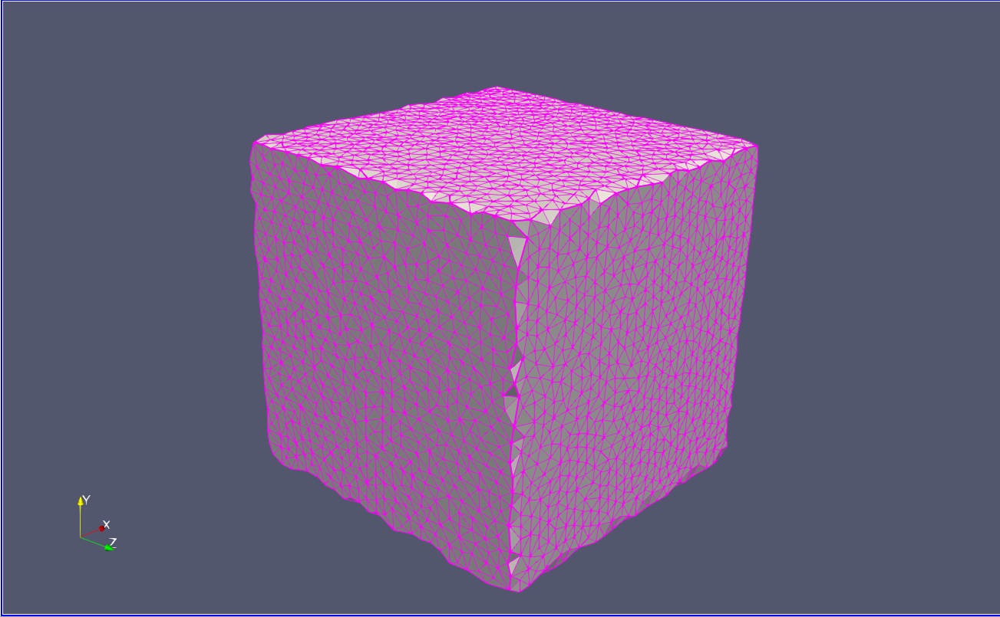
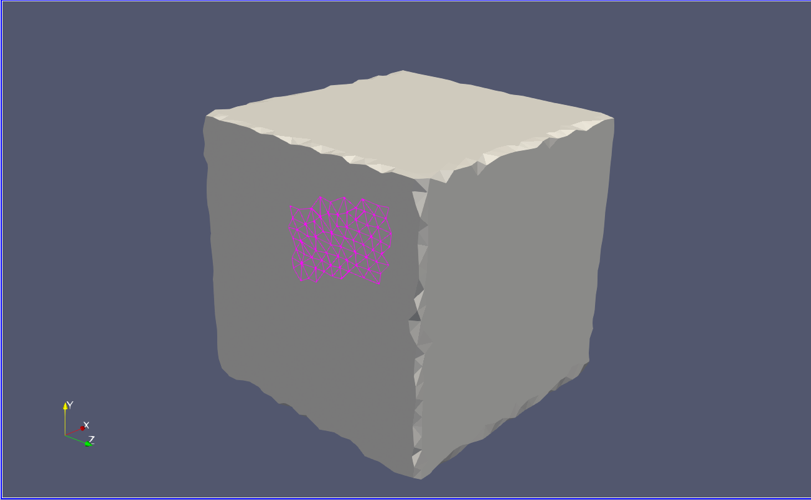

# Input mesh format

The input mesh files must be in the ASCII VTK legacy format (.vtk) where all the cells are represented by a single vtkCell object. The cell meshes must be closed and homeomorphic to a sphere. The initial meshes do not necessarily have to be triangulated. The structure of a VTK file format is the following:

```
# vtk DataFile Version 4.2
vtk output
ASCII
DATASET UNSTRUCTURED_GRID

POINTS 16 float
8e-06 0 0 1.5e-05 0 0 1.5e-05 0 7e-06 
8e-06 0 7e-06 8e-06 7e-06 0 1.5e-05 7e-06 0 
8e-06 7e-06 7e-06 1.5e-05 7e-06 7e-06 0 0 0 
7e-06 0 0 7e-06 0 7e-06 0 0 7e-06 
0 7e-06 0 7e-06 7e-06 0 0 7e-06 7e-06 
7e-06 7e-06 7e-06 

CELLS 2 100
49 12 3 0 1 3 3 2 3 1 3 0 4 1 3 5 1 4 3 0 3 4 3 6 4 3 3 1 5 2 3 7 2 5 3 5 4 7 3 6 7 4 3 3 2 6 3 7 6 2 
49 12 3 8 9 11 3 10 11 9 3 8 12 9 3 13 9 12 3 8 11 12 3 14 12 11 3 9 13 10 3 15 10 13 3 13 12 15 3 14 15 12 3 11 10 14 3 15 14 10 

CELL_TYPES 2
42
42

CELL_DATA 2
FIELD FieldData 1
cell_type_id 1 2 int
0 0 
```

If the VTK file Version is different than 4.2 you might experience some issues when reading the file. The `POINTS` section contains the coordinates of the vertices of the mesh. At each line the coordinates of 3 points are stored (x1 y1 z1 x2 y2 z2 x3 y3 z3).

The `CELLS` section contains the connectivity of the mesh. Each line corresponds to a different cell. The first integer of the line corresponds to the number of integers required to represent the cell mesh. The second interger of this line corresponds to the number of faces in the cell. Then each face of the cell is stored with the following format: `# nodes in the face` `f_n1_id` `f_n2_id` ...

The `CELL_TYPES`  section indicates to the Paraview software that each cell is a polyhedron (42) and should be loaded as such. 

The final section (`cell_type_id`) is used by SimuCell3D to define the biological cell type of each cell
```
0 = epithelial 
1 = ecm
2 = lumen 
3 = nucleus 
4 = static cell
```


## Mesh format conversion
Most mesh formats such as PLY, STL or OBJ do not regroup all the faces of a cell in a common entity. They store the meshes in a structure called 'triangle soup'. These mesh files therefore have to be converted to the VTK legacy format.
The following python script can be used to perform this conversion:

```
path/to/SimuCell3D_v2/scripts/mesh_conversion/convert_to_cell_mesh.py
```

This script can be called in the following way:

```
python convert_to_cell_mesh.py path_to_input_mesh path_to_output_mesh
```

Example:
``` 
python convert_to_cell_mesh.py input_mesh.stl output_mesh.vtk
```

You can check that the meshes have the correct format in Paraview, by consecutively pressing the `Ctrl` and `s` keys and then clicking on the cell. You should see the cells being highlighted like in the follwing picture:
<p align="center">
    
</p>

If the meshes are not correctly loaded, you will obtain a result similar to the following:
<p align="center">
    
</p>
