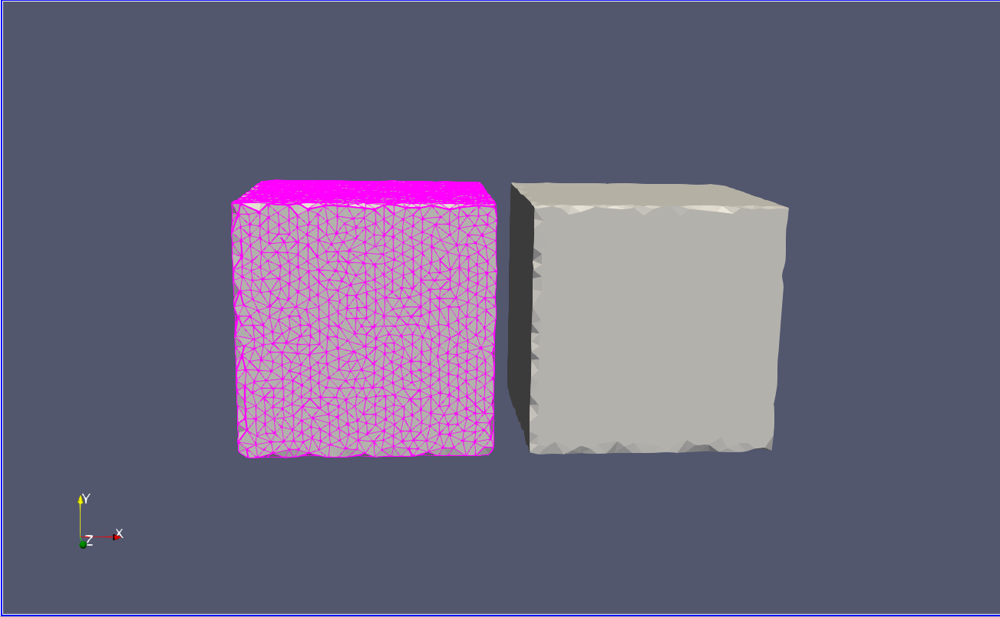
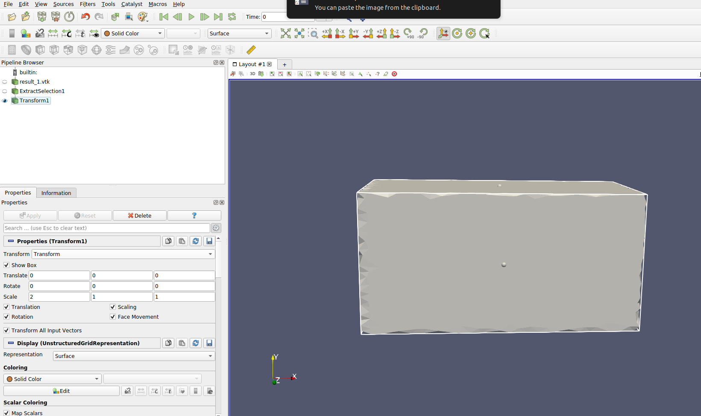
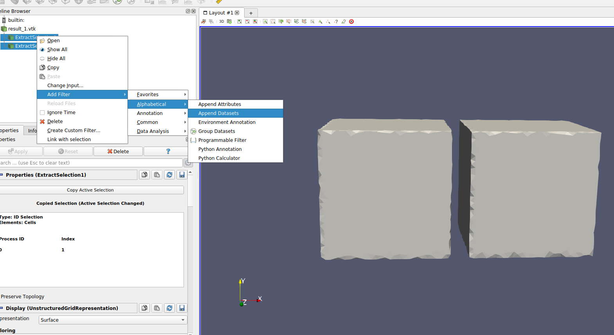
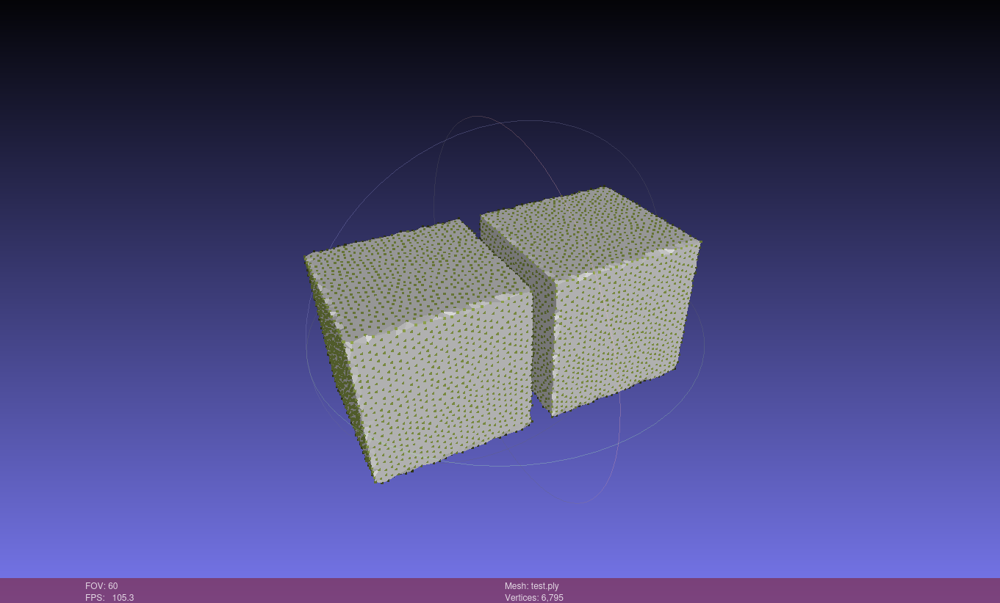
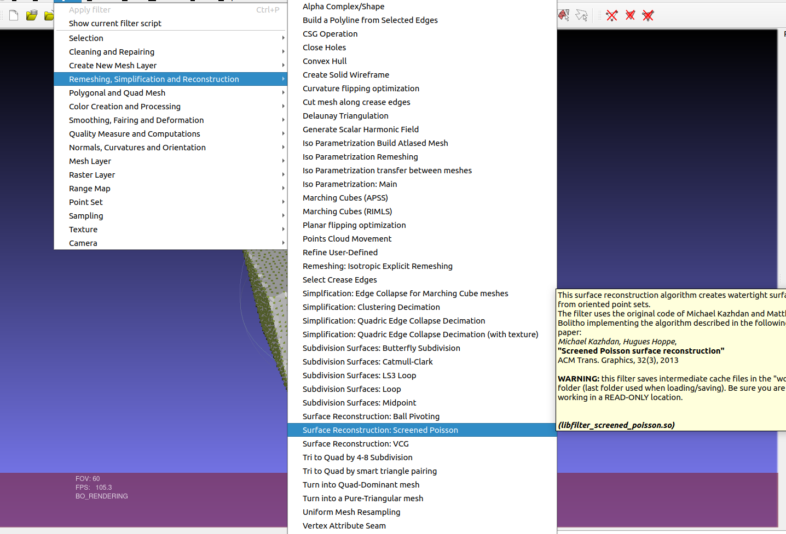
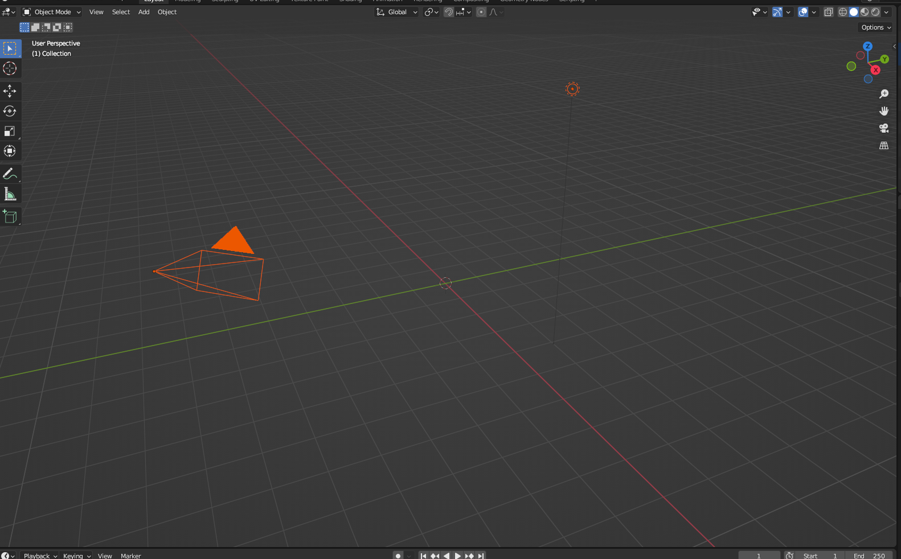

# Mesh generation

Generating meshes is a cumbersome task. However, there are some tools that can facilitate this process. 

## Paraview
The first one is the [Paraview](https://www.paraview.org/download/) software.

You can select a cell from a tissue by first clicking on the `Ctrl` key and then clicking on the `s` key and finally by making a left click on the cell you want to extract:

    

You can then extract this cell from the rest of the mesh by using the filter `extract selection`:

    

The extracted cell can then be translated, rotated and scaled to the desired position with the `transform` filter:

    

Different meshes can be regrouped in one mesh with the `append datasets` filter:

    

 

## MeshLab
The meshlab software can also be used to generate meshes. It is available [here](http://www.meshlab.net/).

    

It contains various filters that can be used to smooth the meshes, remove points or triangles or regenerate the mesh surfaces.

    

 

## Blender

If you have to generate a mesh from start Blender is probably the best option. It is a free and open source 3D creation suite designed for videos and games production. It is available [here](https://www.blender.org/download/).

Blender offers a wide range of tools to create meshes, to sculpt the meshes and to position their nodes:

    

