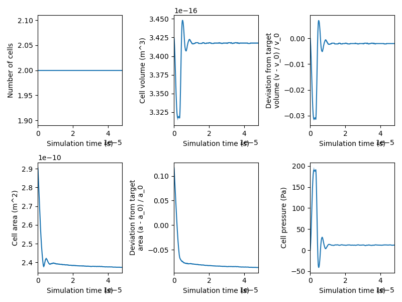
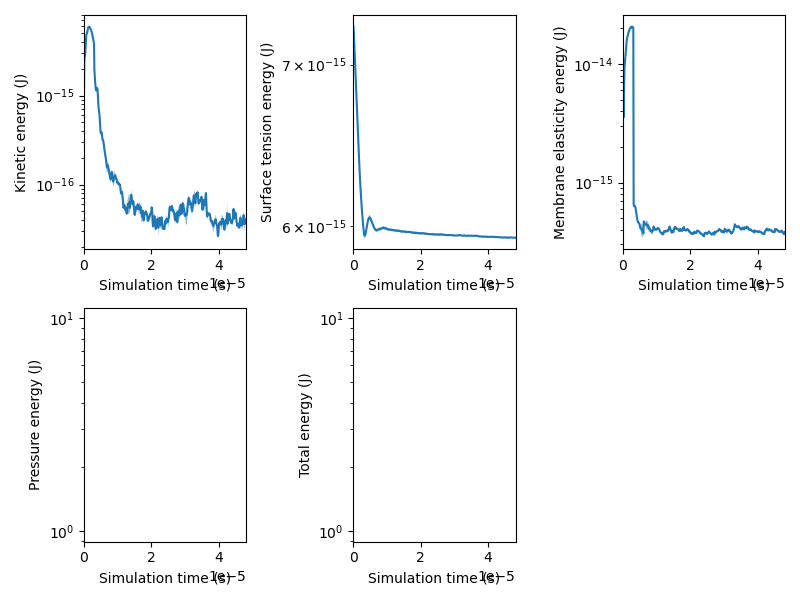
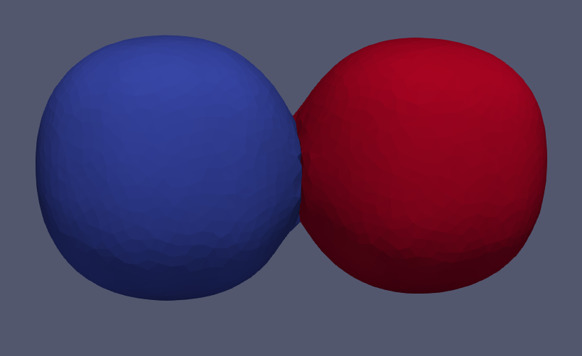
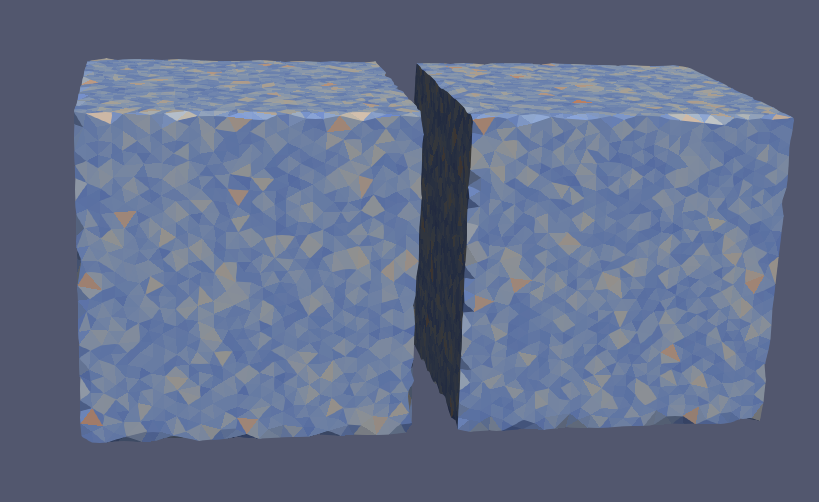

# Simulation statistics

SimuCell3D saves three different types of files. 

# CSV file
First, it saves the cell statistics in a csv file named `simulation_statistics.csv` located in the output simulation folder. This file contains statistics about the cells as a function of time (cell volumes, areas, pressures, kinetic energies..). The python script located  in: 
```
path/to/SimuCell3D/scripts/data_plotting/
``` 

can be called in the following way:

```
python3 plot_data.py path/to/simulation_output_folder
``` 

To generate from this CSV file the following plots:
<p align="center">
    
</p>


<p align="center">
    
</p>

To save additional statistics, the user can add a new function in the vector named `file_data_mapper_lst` of the file `path\to\SimuCell3D\include\io\mesh_data.hpp`.

Example:
```
    cell_data_mapper("cell_nb_nodes", "int", [](cell_ptr c) -> std::string {
        return format_number(c->get_node_lst().size(), "%d");
    }),
 ```   
    
After that you should recompile the code otherwise your new function will not be taken into account:
``` 
    cd path\to\SimuCell3D\build
    make
```  
This new function would generate a new column named `cell_nb_nodes` in the `simulation_statistics.csv` file where the number of nodes of each cell would be saved. 


# Cell meshes

Cell meshes are meshes where all the faces of a given cell are regrouped in one vtkCell entity. This type of mesh can be used to visualize the attributes of the cells (ex: volume, pressure etc).

<p align="center">
    
</p>

Similarly, new attributes can be added to the cell meshes, by adding a new function in the vector named `cell_data_mapper_lst` of the file `path\to\SimuCell3D\include\io\mesh_data.hpp`. 


# Face meshes
Face meshes are meshes where all the faces are stored as individual cells. Then can be used to visualize the attributes of the faces of the cells (triangle area, adhesion energy etc).

<p align="center">
    
</p>
